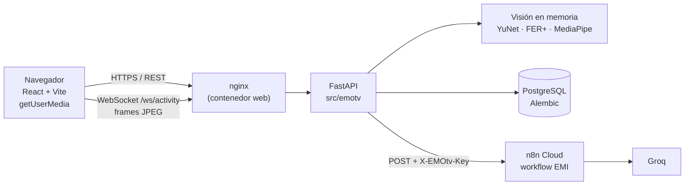

# EMOtv

EMOtv es una **plataforma formativa** desarrollada como proyecto de innovación
para la Facultad de Psicología de la Universidad Nacional Hermilio Valdizán
(Huánuco). Con la cámara del navegador:

1. **estima la expresión facial** visible (detección YuNet y clasificación
   FER+ ONNX);
2. muestra **información educativa** sobre la expresión estimada;
3. recomienda una **actividad guiada de dos o más posturas** y verifica cada
   postura con MediaPipe y reglas geométricas.

Incluye inicio de sesión con roles, consentimiento configurable, historial de
sesiones y **Emi**, un chatbot educativo (workflow de n8n Cloud con Groq).

> **Aviso.** EMOtv es una herramienta formativa. **Estima una expresión
> facial; no diagnostica**, no determina el estado emocional ni psicológico de
> nadie y no sustituye a un profesional. Las actividades son actividad física
> guiada, no terapia, y no prometen cambios en el estado de ánimo.

Versión actual: **1.0.0-rc.1** (ver [CHANGELOG.md](CHANGELOG.md) y los
[criterios de aceptación](docs/thesis-evidence/README.md#criterios-de-aceptación)).

## Arquitectura



- La cámara se abre **en el navegador**; el servidor nunca abre una cámara
  física. Los frames se procesan en memoria y se descartan: **no se guardan
  fotografías ni video**.
- La cara se usa para la expresión; el cuerpo, solo para verificar posturas.
- Detalle en [docs/architecture.md](docs/architecture.md) y modelo de datos en
  [docs/data-model.md](docs/data-model.md).

## Inicio rápido con Docker

Requiere Docker Desktop (o Docker Engine con Compose v2).

```powershell
copy .env.docker.example .env.docker   # completa los valores __GENERATE__
docker compose --env-file .env.docker up -d --build
docker compose --env-file .env.docker exec api python scripts/security/create_admin.py --email admin@ejemplo.local
```

Abre <http://localhost:8080>, entra con la cuenta de administración (la clave
provisional se muestra una vez y se cambia en el primer acceso) y crea las
cuentas desde **Usuarios**. La guía completa, incluido HTTPS en la red local,
está en [docs/docker.md](docs/docker.md).

## Inicio para desarrollo

Requiere Python 3.12, Node.js 20 o superior y PostgreSQL (o el modo «solo base
de datos» de Docker).

```powershell
python -m venv .venv
.\.venv\Scripts\Activate.ps1
python -m pip install -e ".[dev]"
python scripts/download_models.py        # YuNet, FER+ y MediaPipe Pose, con SHA-256
copy .env.example .env                   # DATABASE_URL, JWT_SECRET_KEY, ...
python -m alembic upgrade head
python -m uvicorn emotv.interfaces.web.app:app --reload   # API en :8000
cd web; npm ci; npm run dev                               # web en :5173 (proxy de la API y /ws)
```

Pruebas:

```powershell
python -m pytest -q
cd web; npx tsc -b; npx vitest run
bash scripts/e2e/run_isolated.sh       # e2e con Playwright (docs/testing/e2e.md)
```

Activa el hook que bloquea commits con credenciales (una vez por clon):
`git config core.hooksPath .githooks`. Ver [docs/security.md](docs/security.md).

## Roles

| Rol | Puede |
| --- | --- |
| Estudiante (`student`) | aceptar o revocar el consentimiento, analizar su expresión, hacer actividades, ver su historial y conversar con Emi |
| Psicología (`psychologist`) | consultar solo a los estudiantes que administración le asignó y sus sesiones |
| Administración (`admin`) | crear cuentas, asignar estudiantes, editar actividades, recomendaciones y textos del catálogo de expresiones |

Los permisos se aplican en FastAPI, no solo ocultando botones en la interfaz.

## Variables de entorno

Plantillas: [.env.example](.env.example) (desarrollo) y
[.env.docker.example](.env.docker.example) (Docker). Nunca se versionan
valores reales.

| Variable | Uso |
| --- | --- |
| `DATABASE_URL` | conexión PostgreSQL (`postgresql+psycopg://…`) |
| `JWT_SECRET_KEY` | firma de los tokens; 32 caracteres aleatorios o más |
| `ENVIRONMENT` | `development` o `production` |
| `CONSENT_MODE` | `development` (solo el desarrollador), `demo` (voluntarios y presentación), `production` (política institucional aprobada) |
| `CORS_ORIGINS`, `TRUSTED_HOSTS` | orígenes y hosts permitidos |
| `LOGIN_MAX_FAILURES_PER_ACCOUNT`, `LOGIN_MAX_FAILURES_PER_IP`, `LOGIN_ATTEMPT_WINDOW_MINUTES` | límite de intentos de inicio de sesión |
| `LIVE_STABLE_SECONDS`, `LIVE_MIN_CONFIDENCE` | condiciones para registrar una expresión |
| `EMOTION_*`, `FERPLUS_BENCHMARK_PATH` | admisión del modelo facial según el benchmark del servidor |
| `N8N_WEBHOOK_URL`, `N8N_WEBHOOK_KEY`, `N8N_TIMEOUT_SECONDS` | workflow de Emi; sin clave, el chat responde 503 |
| `CHAT_*` | historial, retención (90 días) y límites de uso de Emi |
| `TEST_DATA_RETENTION_DAYS` | plazo (1 a 30 días) de las cuentas de voluntarios `PRUEBA-NN` |
| `SSL_CERT_FILE` | CA adicional en redes que inspeccionan HTTPS |

## Limitaciones conocidas

- La estimación depende de la luz, el ángulo, la distancia, la cámara y el
  contexto cultural. FER+ se entrenó con imágenes de otras poblaciones; no se
  ha evaluado su precisión con estudiantes de la UNHEVAL.
- El benchmark de FER+ es una medición de rendimiento en el equipo evaluado,
  no una garantía de precisión ni de rendimiento en otro servidor
  ([docs/thesis-evidence/benchmark-ferplus.md](docs/thesis-evidence/benchmark-ferplus.md)).
- La verificación de posturas usa reglas geométricas para cinco posturas
  (brazos arriba, abiertos, al frente, manos en las caderas y sentadilla); no
  evalúa la calidad del movimiento.
- El análisis ocurre en el servidor: la capacidad del servidor limita cuántas
  sesiones simultáneas son fluidas. No se midió con varias sesiones a la vez.
- La cámara solo funciona por HTTPS o en `localhost`.
- Las pruebas automáticas no incluyen a una persona real frente a la cámara;
  esas pruebas están en [docs/testing/manual-checklist.md](docs/testing/manual-checklist.md).
- `production` exige una política de consentimiento aprobada por la
  institución, que todavía no existe.

## Documentación

- [Arquitectura](docs/architecture.md) · [Modelo de datos](docs/data-model.md) · [API](docs/api.md)
- [Docker](docs/docker.md) · [Seguridad](docs/security.md) · [Privacidad y gobierno de datos](docs/privacy-data-governance.md)
- [Consentimiento demo](docs/consent-demo.md) · [Protocolo con voluntarios](docs/testing/volunteer-protocol.md)
- [Pruebas e2e](docs/testing/e2e.md) · [Lista de pruebas manuales](docs/testing/manual-checklist.md) · [Pruebas](tests/README.md)
- [Emi](docs/chatbot-emi.md) · [Catálogo de expresiones](docs/expression-catalog.md) · [Actividades secuenciales](docs/sequential-activities.md)
- [Modelos faciales](docs/emotion-models.md) · [Línea base FER+](docs/ferplus-baseline.md) · [Posturas](docs/pose-estimation.md)
- [Evidencia para la tesis](docs/thesis-evidence/README.md) · [CHANGELOG](CHANGELOG.md)
- [Frontend](web/README.md) · [Scripts](scripts/README.md) · [Modelos y pesos](models/README.md)
