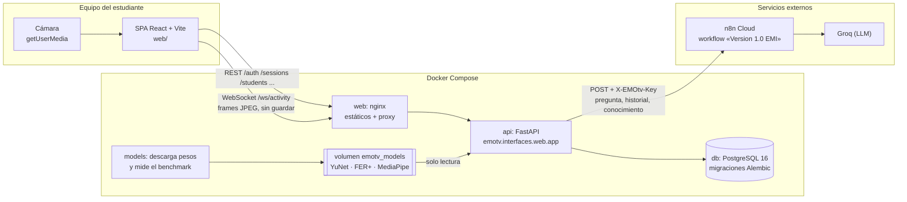
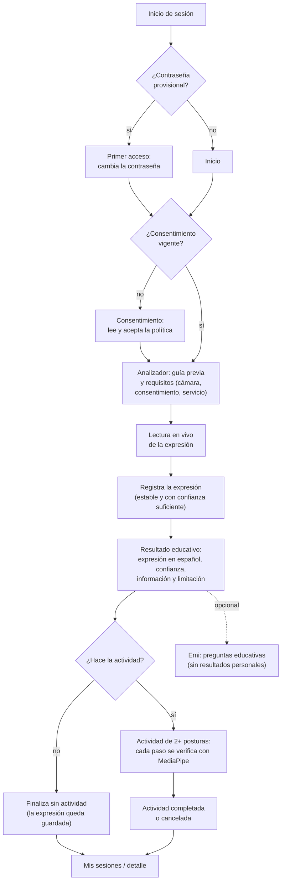

# Arquitectura de EMOtv

EMOtv tiene dos piezas que se despliegan por separado:

- **Frontend** React + TypeScript + Vite en `web/`. Obtiene la cámara en el
  navegador con `getUserMedia` y envía frames JPEG por WebSocket.
- **Backend** FastAPI en `src/emotv/` (`emotv.interfaces.web.app:app`), con
  PostgreSQL + Alembic como única base de datos.

**El servidor nunca abre una cámara física.** Recibe frames, los procesa en
memoria y los descarta; no guarda fotografías ni video.

Las versiones visuales de estos diagramas están en
[thesis-evidence/diagrams/](thesis-evidence/diagrams/). Si difieren, la fuente
de verdad son el código y las migraciones.

## Diagrama del sistema



Dentro de la API, cada frame recorre esta cadena:

```text
Navegador (getUserMedia)
    -> JPEG por WebSocket /ws/activity (token, sesión, actividad)
    -> EmotionFrameAnalyzer: YuNet (rostro) + FER+ ONNX (expresión y distribución)
    -> LiveExpressionTracker (EmotionStabilizer): lectura en vivo, nada persistido
    -> el estudiante confirma -> SessionService.record_recognition (expresión elegida)
    -> ActivityRecommendationService (2+ posturas) -> actividad u omitirla
    -> PoseService: MediaPipe + PostureValidator (solo posturas)
    -> BrowserActivityService -> progreso y estado al navegador
    -> SessionService -> PostgreSQL (resultado, sin imágenes)
```

## Flujo del estudiante



En cualquier momento el estudiante puede revocar el consentimiento: los
análisis nuevos quedan bloqueados y las sesiones registradas se conservan.
Salir de la página, cancelar o terminar apaga la cámara.

La expresión se estima solo a partir del rostro. El cuerpo se usa
exclusivamente para verificar posturas; nunca se infieren emociones desde los
landmarks corporales. El resultado es una estimación de la expresión facial, no
un diagnóstico.

## Capas

### Dominio (`emotv.domain`)

Modelos independientes de frameworks: `PoseLandmark(s)`, `PoseResult`,
`PostureId`, `PostureResult`, `Activity` y sus pasos, `ExerciseStatus`,
`StabilizedEmotion`, `EmotionalSession` y `SessionState`, `User`, `Role`,
`Student`, consentimientos y `PsychologistAssignment`. El dominio no importa
OpenCV, MediaPipe, SQLAlchemy ni FastAPI.

### Aplicación (`emotv.application`)

- `BrowserActivityService`: coordina los frames del navegador con la actividad
  y entrega el estado de cada paso.
- `PoseService` y `ExerciseService`: validación de postura y tiempo sostenido.
- `EmotionStabilizer`: emoción dominante en una ventana móvil con confianza,
  muestras y acuerdo mínimos.
- `ActivityRecommendationService` y `ActivityCatalog`: asociaciones
  expresión → actividad leídas de PostgreSQL (`emotion_activity_recommendations`)
  en cada recomendación, sin estado en memoria. Descarta con un aviso en el log
  las actividades inexistentes o de un solo paso y nunca interrumpe el análisis.
  No son una recomendación clínica. `RecommendationConfigService` valida su
  edición por administración.
- `EmotionModelCatalog` y el contrato `EmotionClassifier`.
- `evaluate_resources`: política de admisión `SUPPORTED`/`WARNING`/`BLOCKED`.
- `SessionService`, `AuthenticationService`, `AuthorizationService`,
  `ConsentPolicyService`, `IdentityRegistrationService` y `LoginThrottle`.
- Puertos (`application.ports`) para repositorios de sesiones, actividades,
  usuarios, estudiantes, consentimientos, asignaciones e intentos de login.

### Infraestructura (`emotv.infrastructure`)

- `vision.face_detection.YuNetFaceDetector` (`face_detection_yunet_2026may.onnx`).
- `vision.emotion_classifier`: FER+ ONNX (predeterminado), HardlyHumans ViT
  (experimental, extra `emotion-vit`), fábrica, `EmotionFrameAnalyzer` y
  `ServerModelAdmission`.
- `vision.pose_detection.PoseDetector` (MediaPipe en modo `VIDEO`) y
  `vision.movement_analysis` (`PostureValidator`, ángulos).
- `persistence`: adaptadores PostgreSQL y en memoria, modelos ORM y conexión.
- `chat.N8nWebhookChatGateway` para Emi: llama al workflow EMI de n8n Cloud,
  que usa Groq. Nunca recibe resultados personales ni identificadores del
  usuario. Ver [chatbot-emi.md](chatbot-emi.md).

### Interfaces (`emotv.interfaces.web`)

- Routers de autenticación, identidades, sesiones, actividades, análisis y chat.
- `WebSocket /ws/activity`: autenticación en el primer mensaje, propiedad de la
  sesión, consentimiento vigente, admisión del modelo y limpieza al cerrar.
- `GET /` devuelve un estado simple; `GET /health` comprueba base de datos y
  pesos para Docker.
- Seguridad HTTP: CORS, hosts de confianza, cabeceras y validación de Origin.

## Modelo facial

El estudiante analiza siempre con FER+ (`ferplus_onnx`). Solo administración
consulta `GET /analysis/models` y puede elegir otro `emotion_model_id` en el
WebSocket; si un estudiante envía otro modelo, el servidor lo rechaza con
`4403`. La UI oculta el selector a estudiantes, pero la restricción se aplica en
FastAPI.

Antes de cargar el clasificador, el WebSocket vuelve a evaluar la admisión del
modelo: un cliente no puede evitar el bloqueo manipulando la interfaz y no hay
fallback silencioso. Una evaluación ausente, insuficiente o vencida bloquea
incluso FER+, y el motivo llega al navegador como mensaje de error. Tras cargar
el clasificador se registran `emotion_model_id` y `emotion_model_version` en la
sesión. La inferencia ocurre en el servidor, así que su capacidad es la que
determina la admisión. Véanse [condiciones actuales](emotion-model-candidates.md)
y [trabajo pendiente](adaptive-emotion-models-plan.md).

## Sesiones, identidad y autorización

```text
HTTP/WS -> router -> autenticación/autorización -> servicio de aplicación
                                                  -> puerto -> PostgreSQL
```

`AuthorizationService` aplica permisos por `Role` y `AccessAction`, con
comprobación de propiedad para estudiantes y de asignación explícita para
Psicología. Toda restricción se aplica en FastAPI, no solo ocultando botones.
`SessionService` es independiente de FastAPI y SQLAlchemy; el filtro por
estudiante forma parte de `SessionRepository`. Detalles en
[Sesiones y persistencia](sessions.md) y
[Privacidad y gobierno de datos](privacy-data-governance.md).

## Pesos de modelos

Los pesos viven en `models/weights/` y no se versionan. `scripts/download_models.py`
es la única descarga de los modelos requeridos (YuNet 2026may, FER+ y
MediaPipe Pose); verifica SHA-256 y es idempotente. En Docker lo ejecuta el
servicio `models` sobre su volumen antes de arrancar la API.

## Herramientas de diagnóstico local

`scripts/diagnostics/` contiene `OpenCVCamera`, una vista previa y `PoseDrawer`.
Solo los usan scripts que abren la webcam del equipo del desarrollador para
probar modelos a mano (`scripts/run_*_test.py`, `scripts/poses/run_*`,
`scripts/emotion/run_face_detection_test.py`). Quedan fuera del producto: la API
no los importa y la imagen Docker no los ejecuta. No usarlos con voluntarios.

## Modelo de datos

Tablas, relaciones y reglas de borrado en [data-model.md](data-model.md).

## Decisiones relevantes

- MediaPipe trabaja en modo `VIDEO` con timestamps monotónicos.
- Solo se transforma al dominio el subconjunto de landmarks necesario.
- La pérdida de la postura durante `holding` reinicia tiempo y progreso.
- Una recomendación automática siempre tiene dos o más posturas.
- Ningún detector o validador corporal conoce el repositorio de sesiones.
- El LLM nunca decide la emoción y no recibe resultados personales.
