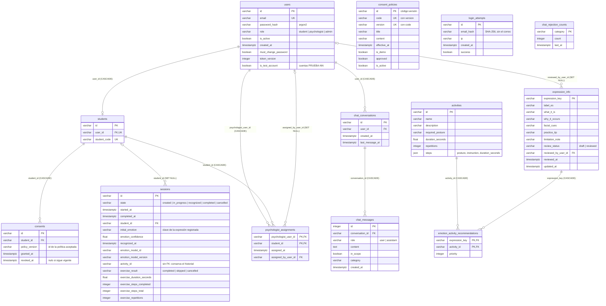

# Modelo de datos

Derivado de las migraciones de `migrations/versions/` (de `20260908_01` a
`20261009_16`), aplicadas con `alembic upgrade head` sobre PostgreSQL 16 y
leído del esquema resultante (`information_schema`). Si este documento y las
migraciones difieren, mandan las migraciones.

PostgreSQL es la única base de datos. **No hay tablas de imágenes**: los
frames se procesan en memoria y se descartan.

## Tablas

| Tabla | Migración | Contenido |
| --- | --- | --- |
| `sessions` | `20260908_01`, `_02`, `20260916_05`, `20261008_11`, `20261009_14` | una sesión de análisis: estado, expresión registrada y su confianza, modelo usado y resultado de la actividad |
| `users`, `students`, `consents` | `20260908_03`, `20260918_06`, `20261009_16` | cuentas, perfil estudiantil (código, nunca nombre) y consentimientos con fecha de aceptación y revocación |
| `activities` | `20260915_04`, `20260921_08` | actividades con su secuencia de pasos (`steps` en JSON) y repeticiones |
| `consent_policies` | `20260918_07` | políticas de consentimiento versionadas; una sola activa |
| `login_attempts` | `20261006_09` | intentos de inicio de sesión para el límite por cuenta e IP; guarda el hash del correo |
| `psychologist_assignments` | `20261006_10` | qué estudiantes puede consultar cada cuenta de Psicología |
| `expression_info` | `20261008_12` | textos educativos de cada expresión y su estado de revisión |
| `emotion_activity_recommendations` | `20261009_13` | actividades recomendadas por expresión, en orden de prioridad |
| `chat_conversations`, `chat_messages`, `chat_rejection_counts` | `20261009_15` | conversaciones con Emi (retención de 90 días) y contadores agregados de preguntas rechazadas por categoría |

## Reglas que se leen en el esquema

- **Borrado de una cuenta.** `students`, `consents`, `chat_conversations`,
  `chat_messages` y las asignaciones se borran en cascada. `sessions.student_id`
  queda en nulo (`SET NULL`): por eso `scripts/testdata/delete_test_data.py`
  borra las sesiones de forma explícita antes de eliminar a un voluntario.
- **Historial estable.** `sessions.activity_id` y `consents.policy_version` no
  tienen clave foránea: si se elimina una actividad o cambia la política, el
  historial conserva el identificador registrado y la interfaz muestra
  «Actividad no disponible».
- **Sin imágenes ni lecturas en vivo.** Solo se guarda la expresión que el
  estudiante registró (`initial_emotion`, `emotion_confidence`,
  `recognized_at`); las lecturas en vivo no se persisten.
- **Sin el correo en los intentos de login.** `login_attempts.email_hash`
  guarda el SHA-256 del correo.
- **Emi.** `chat_rejection_counts` guarda solo un contador por categoría, sin
  texto ni usuario.
